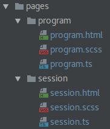
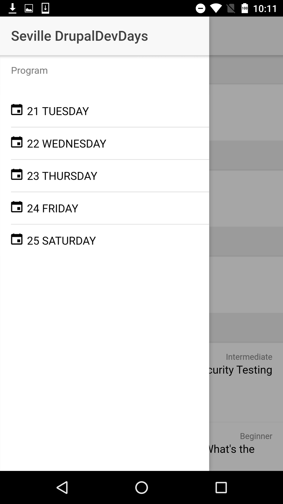

# Step 01 Preparing the application

[**1. Overview**](#1-overview)

[**2. Rename given pages**](#2-rename-given-pages)

[**3. Populate the side menu**](#3-populate-the-side-menu)

## 1. Overview

Our application lives in the src folder and should look like this:


 
Inside of this folder there are two folders we must pay attention to by now:


* **app**: it's the main folder of the app, where the application goes to start and where we configure the main module of our application. This folder contains five files:

  * _app.component.ts_: is the controller of this first view. This is where we will define the items of the side menu and where we will take the actions needed on the application startup.
  * _app.html_: is the first view to be loaded. In our case it's where the side menu is defined.
  * _app.module_: this is where we configure the Angular module of the applications. We must declare here the pages and providers we use in the application.
  * _app.scss_: where we define the global styles of the application.
  * _main.ts_: where the underlying Angular application is bootstrapped.

* **pages**: it's where our pages live (we can associate the idea of a page with the idea of a view o our app). Each page, usually is built with three files:
  * _the markup file_: a html file with the markup of the page.
  * _the styles file_ a scss file with the styles of the page.
  * _the typescript file_: this file acts as the controller of the view and is where we add behavior to the view.
  
## 2. Rename given pages

Our application uses just two views so we will recycle the ones the Ionic CLI gave us to meet our needs. So we need to rename _page1_ folder and files to _program_. If your IDE doesn't dispose of refactoring tools you must make the following changes in the following files.

* **program.ts**:  
  * Change the selector name from _page-page1_ to _page-program_
  * Change the templateUrl from _page1.html_ to _program.html_
  * Change the class name from _Page1_ to _ProgramPage_
* **program.scss**: change the selector from _page-page1_ to _page-program_
* **app.module.ts**: 
  * Change the _Page1_ import from ```import { Page1 } from '../pages/page1/page1';``` to ```import { ProgramPage } from '../pages/program/program';```
  * Change both in *declarations* and *entryComponents* from _Page1_ to _ProgramPage_ 
  
Proceed similarly recycling Page2 into Session:

* **session.ts**:  
  * Change the selector name from _page-page2_ to _page-session_
  * Change the templateUrl from _page2.html_ to _session.html_
  * Change the class name from _Page2_ to _SessionPage_
* **session.scss**: change the selector from _page-page2_ to _page-session_
* **app.module.ts**: 
  * Change the _Page2_ import from ```import { SessionPage } from '../pages/page2/page2';``` to ```import { SessionPage } from '../pages/session/session';```
  * Change both in **declarations** and **entryComponents** from _Page2_ to _SessionPage_
   
Your pages folder should look like this now:



Finally to make things work again we will remove any references to Page1 and Page2 from _app.component.ts_ and we'll let it just pointing to our ProgramPage which will act as our home page. It should look like this:

```typescript
import { Component, ViewChild } from '@angular/core';
import { Nav, Platform } from 'ionic-angular';
import { StatusBar, Splashscreen } from 'ionic-native';
import { ProgramPage } from '../pages/program/program';

@Component({
  templateUrl: 'app.html'
})
export class MyApp {
  @ViewChild(Nav) nav: Nav;

  rootPage: any = ProgramPage;

  pages: Array<{ title: string, component: any }>;

  constructor(public platform: Platform) {
    this.initializeApp();

    // used for an example of ngFor and navigation
    this.pages = [
      { title: 'Program Page', component: ProgramPage }
    ];

  }

  initializeApp() {
    this.platform.ready()
        .then(() => {
          // Okay, so the platform is ready and our plugins are available.
          // Here you can do any higher level native things you might need.
          StatusBar.styleDefault();
          Splashscreen.hide();
        });
  }

  openPage(page) {
    // Reset the content nav to have just this page
    // we wouldn't want the back button to show in this scenario
    this.nav.setRoot(page.component);
  }
}
```

Now everything should work just fine in your application and we can carry on and start with the fun part.

## 3. Populate the side menu

To start giving some content to our application we will start with the side menu. We want something like this:



First we will create an array with the options we want to show in the menu. It will be an array of dates. In order to work easily with dates we will install a library called [momentjs](https://momentjs.com/). In the application folder we will type:
  
```bash
yarn add moment
```

or

```bash
npm i --save moment
```

Once we have our library installed we need to import it in our app.component.ts by adding:

```typescript
import * as moment from 'moment';
```

Now we have available moment in this file and we can create an array of dates like this:

```typescript
pages = [
    { date: moment('2017-03-21') },
    { date: moment('2017-03-22') },
    { date: moment('2017-03-23') },
    { date: moment('2017-03-24') },
    { date: moment('2017-03-25') }
];
```

Don't forget to remove the pages declaration and the use of this legacy variable we had:

```typescript
  pages: Array<{ title: string, component: any }>;
```

and 

```typescript
// used for an example of ngFor and navigation
    this.pages = [
      { title: 'Program Page', component: ProgramPage }
    ];
```

Next we must edit the html where the side menu lives (_app.html_). First we will change the ion-title from **Menu** to **Seville DrupalDevDays**. Then we will add a header to the ion-list:

```html
<ion-list-header>Program</ion-list-header>
```

Now we proceed to arrange our dates buttons. We must keep the _ngFor_ to iterate through our pages but we will change the name of the each item from _p_ to _page_ to be more concise. Since we don't have a behavior yet for this buttons we remove from the button the action associated with the click event:
  
```typescript
(click)="openPage(p)"
```
  
  We must also change the content of each button. Then we remove:
  
 ```typescript
 {{p.title}}
 ```
 
 Now we start to make things look like we want to. We will set an icon and the date properly formatted of each available page. To add the icon we will add a _ion-icon_ component and we will set the attribute name to _calendar_. You have a [huge set of icons](http://ionicframework.com/docs/v2/ionicons/) available to be used out of the box. We want to keep on the left of the button, so we will add the icon-left attribute (actually it is a directive, an Angular construct to extend html).
  
```html
<button menuClose ion-item *ngFor="let page of pages">
  <ion-icon name="calendar"></ion-icon>
</button>
```

Finally we add the text of the button, the properly formatted date. To do so we will use the **page** variable exposed by the ngFor. This variable represents an item of the _pages_ array we defined previously. To print the content of a variable or expression we wrap it in double curly braces **{{}}**. We will take advantage of momentjs features to format the date properly.

```typescript
{{page.date.format('DD dddd')}}
```

The final touch is display this date in uppercase. We will use, _text-uppercase_ another provided directive utility to achieve it (you can check the available utils directives [here](http://ionicframework.com/docs/v2/theming/css-utilities/)).
If everything went right we should have:
  
```html
<button menuClose ion-item *ngFor="let page of pages" icon-left text-uppercase>
  <ion-icon name="calendar"></ion-icon>
  {{page.date.format('DD dddd')}}
</button>
```

