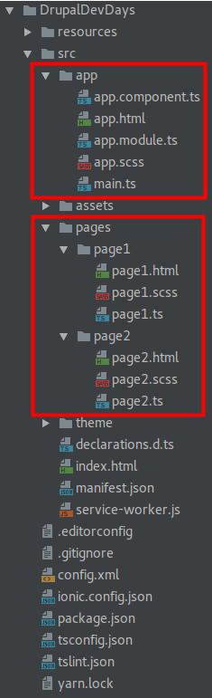

# Step 01 Preparing the application

[**1. Overview**](#1-overview)

## 1. Overview

Our application lives in the src folder and should look like this:

 
Inside of this folder there are two folders we must pay attention to by now:

* **app**: it's the main folder of the app, where the application goes to start and where we configure the main 
module of our application. This folder contains five files:

  * _app.component.ts_: is the controller of this first view. This is where we will define the items of the side menu
   and where we will take the actions needed on the application startup.
  * _app.html_: is the first view to be loaded. In our case it's where the side menu is defined.
  * _app.module_: this is where we configure the Angular module of the applications. We must declare here the pages 
   and providers we use in the application.
  * _app.scss_: where we define the global styles of the application.
  * _main.ts_: where the underlying Angular application is bootstrapped.

* **pages**: it's where our pages live (we can associate the idea of a page with the idea of a view o our app). Each 
page, usually is built with three files:
  * _the markup file_: a html file with the markup of the page.
  * _the styles file_ a scss file with the styles of the page.
  * _the typescript file_: this file acts as the controller of the view and is where we add behavior to the view.