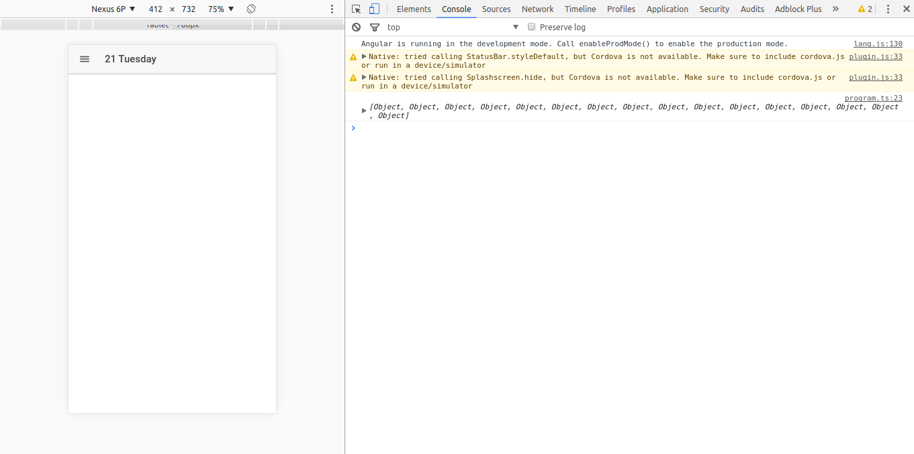

# Step 02 Populate the Program Page

[**1. Getting data from Drupal**](#1-getting-data-from-drupal)

[**2. Transforming the response**](#2-transforming-the-response)

## 1. Getting data from Drupal

It's time to give some content to our **Program Page**. But to do it we must get data from somewhere and here is where the RESTful api we prepared on Drupal comes into play.
In order to keep separation of concerns Ionic use classes called **Providers**. These classes are normal plain classes decorated with the ```@Injectable()``` decorator to allow dependency injection. These classes are singletons, so we can consider them as a way to share information across the application and as a way to store the state of the application. 
We will use the **Ionic CLI** again to generate the provider we need by typing in the project folder:
```bash
ionic g provider program
```

This will create a _program.ts_ file in a providers folder. I consider good practice to rename this file to **program.service.ts** so it's easier to know the content of the file and to differentiate it from the _program.ts_ page file. We should also rename the class to **ProgramService**.
In order to use our service we must declare it in our module, so we will go to our _app.module.ts_ and add it to the providers array with its corresponding import statement.
This class the Ionic CLI created for us has already injected the Http class (we should make it private). This is the class we use to perform requests. 
We will start declaring a couple of constants that we will need, the base url for oure requests and an object to relate dates with Drupal nodes.

```typescript
  private readonly drupalUrl = 'https://seville2017.drupaldays.org/api';

  private readonly dates = {
    '2017-03-21': 126,
    '2017-03-22': 127,
    '2017-03-23': 128,
    '2017-03-24': 129,
    '2017-03-25': 130,
  };
```

No we create a method to get a program by its date. This method receives a Moment object representing the date and returns an Observable, which is:
> A representation of any set of values over any amount of time. This the most basic building block of RxJS.

It's, then, a construct of [RxJs](http://reactivex.io/rxjs/) the javascript implementation for **Reactive Programming**. 
Our method, for now, just makes the requests and gets the data from the response:

```typescript
getProgram(date: Moment): Observable<any[]> {
  const programId = this.dates[date.format('YYYY-MM-D')];

  return this.http
             .get(`${this.drupalUrl}/${programId}`)
             .map(res => res.json());
}
```

We will improve this method later, now we are gonna give it a try.
We will go back to our _program.ts_ file and add a new method called **ionViewDidLoad**. This method is a lifecycle hook and it will be called by Ionic once the page has been loaded. It's then the moment to request the asynchronous content of the page.
In this method we will call our service method and then subscribe to the result and print it to the console to check if it's working:
```typescript
ionViewDidLoad() {
  this.programService.getProgram(this.navParams.data as Moment)
      .subscribe(program => console.log(program));
}
```

You should now be getting something like this:



## 2. Transforming the response

Now that we have the data from the Drupal backend we need to adapt it to our need. Inspecting the response we can see that there are three different types of entities mixed in the program: sessions, keynotes and breaks. As for our needs we can consider all of them as a single entity or class: **Session**.
Then we need to define this Session as an _interface_ or as a _class_. We will pick a class so we delegate the responsibility of creating an instance of the class from the raw response to the class itself. We will create a new session.ts typescript file in new **shared** folder.
This is what we need right now, we will refactor the class as we need it.

```typescript
export class Session {
  id: string;
  title: string;
  startTime: string;
  endTime: string;
  level?: string;
  target?: string;
  type?: string;
  venue?: string;
}
```

We can add now a constructor that takes one of the objects from Drupal an returns a Session object.

```typescript
  constructor(rawSession: any = {}) {
    const times = rawSession.field_start_end_period ? rawSession.field_start_end_period.split(' - ') : null;

    this.id = rawSession.nid;
    this.title = rawSession.field_break_title || rawSession.title;
    this.startTime = times && times[0];
    this.endTime = times && times[1];
    this.level = rawSession.field_session_level;
    this.target = rawSession.field_session_track_type;
    this.type = rawSession.field_session_type;
    this.venue = rawSession.field_break_description || rawSession.field_room;
  }
```

We can use this new class definition to map our response adding a new map statement in our service and change the returned type to Observable<Session[]>:
```typescript
  getProgram(date: Moment): Observable<Session[]> {
    const programId = this.dates[date.format('YYYY-MM-D')];

    return this.http
               .get(`${this.drupalUrl}/${programId}`)
               .map(res => res.json())
               .map(rawSessions => rawSessions.map(rawSession => new Session(rawSession)));
  }
```
We also can take advantage of the typing and sort the response by its starting date adding a new map statement:
```typescript
.map(sessions => sessions.sort((s1, s2) => s1.startTime.localeCompare(s2.startTime)))
```