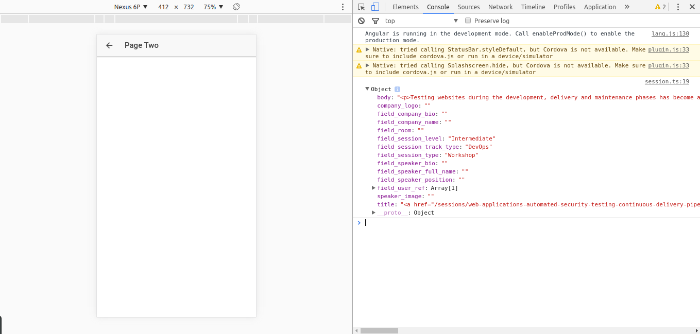
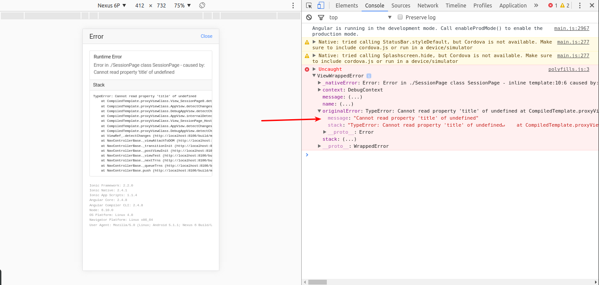
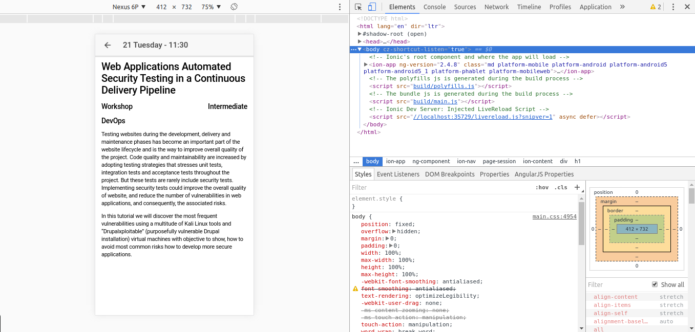

# Step 03 Populate the Session Page

[**1. Enable navigation to the Session Page**](#1-enable-navigation-to-the-session-page)

[**2. Getting the session details from Drupal**](#2-getting-the-session-details-from-drupal)

[**3. Displaying session details**](#3-displaying-session-details)
## 1. Enable navigation to the Session Page

First things first. We need a way to navigate to the Session page. In this case we don't want to set the root of the application, instead we want to push a new page to our navigation stack.
So we will bind the _click_ event of the _ion-item_ element to a **goToSession** method in our ProgramPage class. This method will receive the session itself, check if it is a break or an actual session and push the new view to the stack.
```typescript
goToSession(session: Session): void {
  // We don't want to see the details of the breaks.
  if (session.type) {
    this.navCtrl.push(SessionPage, { sessionId: session.id, date: this.navParams.data, startTime: session.startTime });
  }
}
```

We pass to the next view the id of the session so we can fetch the session details and the date of the session to display it in the title of the next view.
Don't forget to add the binding to the _ion-item_ element ```(click)="goToSession(session)```.

Now we can navigate to our **Session Page**. Time to remove the example content the Ionic CLI provided to this page. Remove the content of the _ion-content_ element in the _session.html_ file and empty the **SessionPage** so we just have a an empty constructor.
```typescript
export class SessionPage {

  constructor(private navCtrl: NavController, private navParams: NavParams) { }

}
```

## 2. Getting the session details from Drupal

As we did with the Program Page we need to retrieve the details of the session from drupal. So we will create a new provider class to handle it and rename it to follow the same conventions.
Remember to declare the provider in your **AppModule** (_app.module.ts_ file). You can refer to the previous branch where we declared the _ProgramService_ if you have any doubt.
Once we have everything set up we declare the drupalUrl constant ```private readonly drupalUrl = 'https://seville2017.drupaldays.org/api/sessions';```
Next we define the basic method to retrieve the session details:
```typescript
getSession(sessionId: string): Observable<any> {
  return this.http
             .get(`${this.drupalUrl}/${sessionId}`)
             .map(res => res.json()[0]);
}
```

Let's consume it to see what we get. In our **SessionPage** class (_pages/session/session.ts_ file) we will set again the lifecycle hook method **ionViewDidLoad** and we will perform the call to the service in this point.
```typescript
ionViewDidLoad() {
  const sessionId = this.navParams.get('sessionId');

  this.sessionService
      .getSession(sessionId)
      .subscribe(session => console.log(session));
}
```

Don't forget to inject the sessionService using the dependency injection (you can refer to the previous step if you don't recall how to do this).
We should have something like this:



As we did before we are going to define a class to adapt the server response to our needs. So we add a new session-details.ts typescript file in the shared folder.

```typescript
export class SessionDetails {
  title: string;
  description: string;
  type: string;
  level?: string;
  track?:string;
  room?: string;
  speakers?: any[];
  
  constructor(rawSessionDetails: any = {}) {
    this.title = rawSessionDetails.title;
    this.description = rawSessionDetails.body;
    this.type = rawSessionDetails.field_session_type || 'keynote';
    this.level = rawSessionDetails.field_session_level;
    this.track = rawSessionDetails.field_session_track_type;
    this.room = rawSessionDetails.field_room;
    this.speakers = [];
  }
}
```
We will take care of the speakers later.
We can map the raw response to our own class as we did before so we have a SessionDetails instance in our SessionPage class to work with and we can start to display things.

## 3. Displaying session details

We will start with the title as we did before. We want to show the date and the time of the session properly formatted. We can use the constructor to achieve this working with the **NavParams** as we did with the _ProgramPage_.
This time, though we are passing a custom object as params and the way we get them is a little bit different:
```typescript
constructor(private navCtrl: NavController,
              private navParams: NavParams,
              private sessionService: SessionService) {
  const date = (this.navParams.get('date') as Moment).format('DD dddd');
    
  this.title = `${date} - ${this.navParams.get('startTime')}`;
}
```

Remember to declare the _title_ variable and to add the needed imports for _momentjs_.
Now we can substitute the hardcoded title of the page with the title we just built.

Once we have the title properly set we can start to display the session data. To do it, first we need to store the retrieved session from our service in a variable to make it visible by the view, so we declare a session variable and we assign its value on the subscription as we did in the program page.
Now we will display the title of the session in our view to check everything is working fine adding a h1 tag with the title as the innerHtml as we did before.
```html
<h1 [innerHtml]="session.title"></h1>
```

We give a try and we get this:


The error is due to we are trying to access to a property of session when it's already undefined. Remember the _ionViewDidLoad_ is called once the view has been loaded. Then, it's trying to access to session even before we call our service to fetch the data.
There are several ways to fix this. We can wrap what we want to show in an element with a **ngIf** so it won't be rendered until we get data.
Another option is to initialize the session variable with a **new SessionDetails**.
We will use the later as we don't need to keep watching the session once it has been assigned.
Now everything should be working fine and we should be able to view the title of the session.
We can display then the rest of the session details:
```html
<ion-content padding>
  <h1 [innerHtml]="session.title"></h1>
  <h5 class="info-row">
    <span>{{session.type}}</span>
    <span>{{session.level}}</span>
  </h5>
  <h5 class="info-row">
    <span>{{session.track}}</span>
    <span>{{session.room}}</span>
  </h5>

  <div class="session-description" [innerHtml]="session.description" text-wrap></div>
</ion-content>
```

With the following styles:
```scss
page-session {

  .info-row {
    span:nth-child(2) {
      float: right;
    }
  }

  .session-description {
    line-height: 2rem;
  }
}
```

This should produce something similar to this:
