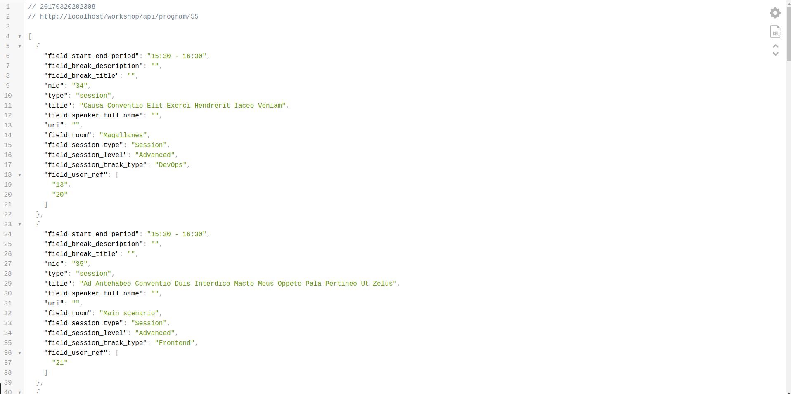

# Setting up Drupal

Before we start with the Ionic project we need a Drupal instance with the API we are going to consume.
We will start cloning [the DrupalDevDays repo](https://github.com/AsociacionDrupalES/devdaysseville) and following the installations instructions.
Once it's installed you can use [the provided db  dump](./dump.sql) to add a program to your DrupalDevDays instance.

```bash
../vendor/bin/drush sql-cli < path-to-your-downloaded-file/dump.sql
```

Finally get your ip to use it in your Ionic application. If everything went fine you should be able now to access your API.

